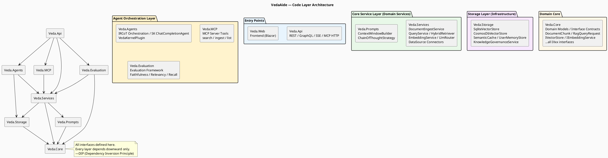
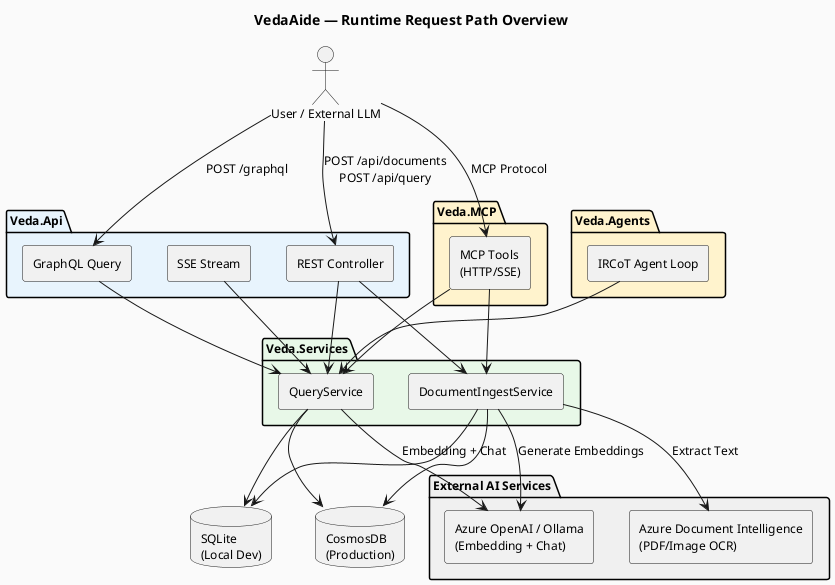
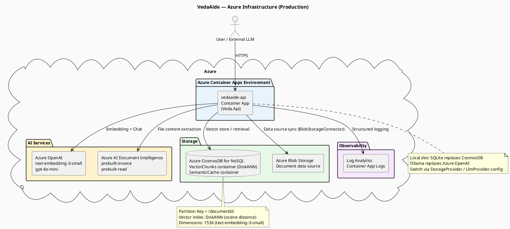

> **Viewing diagrams:** In browser, install [Markdown Diagrams](https://chromewebstore.google.com/detail/markdown-diagrams/mnfehgbmkaijmakeobbflcbldbbldmjh) extension; in VS Code, install [Markdown PlantUML Preview](https://marketplace.visualstudio.com/items?itemName=well-30.plantuml-markdown) plugin.

> 中文版：[01-system-architecture.cn.md](01-system-architecture.cn.md)

# 01 — System Architecture

> This document describes VedaAide's overall architecture: code layering, module responsibilities, and Azure cloud infrastructure.

---

## 1. Code Layer Overview

The system consists of 8 C# projects arranged in four layers: "Core → Services → Infrastructure → Entry Points".

---

## 2. Project Responsibilities

| Project | Responsibility | Key Classes |
|---------|---------------|-------------|
| **Veda.Core** | Domain models + interface contracts, zero external dependencies | `DocumentChunk`, `RagQueryRequest/Response`, `IVectorStore`, `IEmbeddingService`, `IQueryService`, `IDocumentIngestor` … |
| **Veda.Services** | Core RAG business logic, depends on abstract interfaces | `DocumentIngestService`, `QueryService`, `EmbeddingService`, `HybridRetriever`, `LlmRouterService`, `HallucinationGuardService`, `FileSystemConnector`, `BlobStorageConnector` |
| **Veda.Prompts** | Prompt construction strategies, LLM-agnostic | `ContextWindowBuilder` (token budget trimming), `ChainOfThoughtStrategy` (CoT injection) |
| **Veda.Storage** | Storage implementations, pluggable SQLite / CosmosDB | `SqliteVectorStore`, `CosmosDbVectorStore`, `SqliteSemanticCache`, `CosmosDbSemanticCache`, `UserMemoryStore`, `KnowledgeGovernanceService` |
| **Veda.Agents** | LLM Agent orchestration (Semantic Kernel) | `LlmOrchestrationService` (IRCoT loop), `OrchestrationService` (manual chain), `VedaKernelPlugin` (SK KernelFunction) |
| **Veda.MCP** | MCP Server: exposes knowledge base capabilities to external LLMs | `KnowledgeBaseTools` (search / list), `IngestTools` (ingest) |
| **Veda.Evaluation** | RAG evaluation framework (Golden Dataset) | `EvaluationRunner`, `FaithfulnessScorer`, `AnswerRelevancyScorer`, `ContextRecallScorer` |
| **Veda.Api** | HTTP entry point: REST + GraphQL + SSE | `DocumentsController`, `QueryController`, `QueryStreamController`, `DataSourcesController`; background service `DataSourceSyncBackgroundService` |

---

## 3. Runtime Request Path Overview

---

## 4. Azure Cloud Infrastructure

---

## 5. SOLID Principles in Code

| Principle | Where it appears |
|-----------|-----------------|
| **DIP** (Dependency Inversion) | All interfaces defined in `Veda.Core`; `Veda.Services` depends on interfaces, not implementations |
| **SRP** (Single Responsibility) | `IDocumentIngestor` (write) and `IQueryService` (read) are separate; `ContextWindowBuilder` only does token trimming |
| **ISP** (Interface Segregation) | `IVectorStore` read/write split; `IFileExtractor` separate from `IDocumentProcessor` |
| **OCP** (Open/Closed) | Storage layer switches via `Veda:StorageProvider` config without modifying business code; same for LLM provider |
| **DRY** | `UpsertAsync` delegates to `UpsertBatchAsync`; hash calculation encapsulated in `ComputeHash` |
