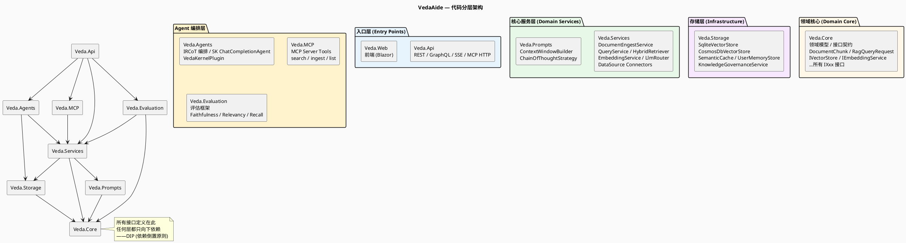
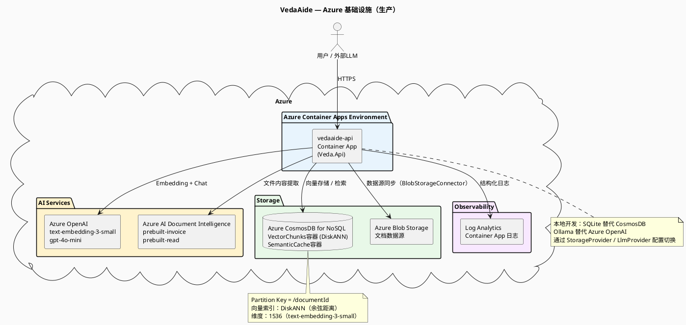

# 01 — 系统整体架构

> 本文描述 VedaAide 的整体架构：代码分层、模块职责、以及 Azure 云基础设施。

---

## 1. 代码分层总览

系统由 8 个 C# 项目组成，按"核心 → 服务 → 基础设施 → 入口"四层排列。



---

## 2. 各项目职责一览

| 项目 | 职责 | 关键类 |
|------|------|--------|
| **Veda.Core** | 领域模型 + 接口契约，零外部依赖 | `DocumentChunk`, `RagQueryRequest/Response`, `IVectorStore`, `IEmbeddingService`, `IQueryService`, `IDocumentIngestor` … |
| **Veda.Services** | RAG 核心业务逻辑，依赖抽象接口 | `DocumentIngestService`, `QueryService`, `EmbeddingService`, `HybridRetriever`, `LlmRouterService`, `HallucinationGuardService`, `FileSystemConnector`, `BlobStorageConnector` |
| **Veda.Prompts** | Prompt 构建策略，与 LLM 无关 | `ContextWindowBuilder`（Token 预算裁剪）, `ChainOfThoughtStrategy`（CoT 注入） |
| **Veda.Storage** | 存储实现，可插拔 SQLite / CosmosDB | `SqliteVectorStore`, `CosmosDbVectorStore`, `SqliteSemanticCache`, `CosmosDbSemanticCache`, `UserMemoryStore`, `KnowledgeGovernanceService` |
| **Veda.Agents** | LLM Agent 编排（Semantic Kernel） | `LlmOrchestrationService`（IRCoT 循环）, `OrchestrationService`（手动链）, `VedaKernelPlugin`（SK KernelFunction） |
| **Veda.MCP** | MCP Server：把知识库能力暴露给外部 LLM | `KnowledgeBaseTools`（search / list）, `IngestTools`（ingest） |
| **Veda.Evaluation** | RAG 评估框架（Golden Dataset） | `EvaluationRunner`, `FaithfulnessScorer`, `AnswerRelevancyScorer`, `ContextRecallScorer` |
| **Veda.Api** | HTTP 入口：REST + GraphQL + SSE | `DocumentsController`, `QueryController`, `QueryStreamController`, `DataSourcesController`；后台服务 `DataSourceSyncBackgroundService` |

---

## 3. 运行时请求路径总览

```plantuml
@startuml runtime-overview
skinparam backgroundColor #FAFAFA
skinparam defaultFontSize 12

title VedaAide — 运行时请求路径总览

actor 用户/外部LLM as Client

rectangle "Veda.Api" #E8F4FD {
  [REST Controller]
  [GraphQL Query]
  [SSE Stream]
}

rectangle "Veda.MCP" #FFF3CD {
  [MCP Tools\n(HTTP/SSE)]
}

rectangle "Veda.Agents" #FFF3CD {
  [IRCoT Agent Loop]
}

rectangle "Veda.Services" #E8F8E8 {
  [DocumentIngestService]
  [QueryService]
}

rectangle "AI 外部服务" #F0F0F0 {
  [Azure OpenAI\nor Ollama\n(Embedding + Chat)]
  [Azure Document Intelligence\n(PDF/图片 OCR)]
}

rectangle "Veda.Storage" #F8E8FF {
  database "SQLite\n(本地开发)" as SQLite
  database "CosmosDB\n(生产)" as CosmosDB
}

Client --> [REST Controller] : POST /api/documents\nPOST /api/query
Client --> [MCP Tools] : MCP Protocol
Client --> [GraphQL Query] : POST /graphql

[REST Controller]  --> [DocumentIngestService]
[REST Controller]  --> [QueryService]
[MCP Tools]        --> [DocumentIngestService]
[MCP Tools]        --> [QueryService]
[GraphQL Query]    --> [QueryService]
[SSE Stream]       --> [QueryService]
[IRCoT Agent Loop] --> [QueryService]

[DocumentIngestService] --> [Azure OpenAI\nor Ollama\n(Embedding + Chat)] : 生成 Embedding
[DocumentIngestService] --> [Azure Document Intelligence\n(PDF/图片 OCR)] : 提取文本
[DocumentIngestService] --> SQLite
[DocumentIngestService] --> CosmosDB

[QueryService] --> [Azure OpenAI\nor Ollama\n(Embedding + Chat)] : Embedding + Chat
[QueryService] --> SQLite
[QueryService] --> CosmosDB

@enduml
```

---

## 4. Azure 云基础设施



---

## 5. 设计原则在代码中的体现

| 原则 | 体现位置 |
|------|---------|
| **DIP**（依赖倒置） | 所有接口定义在 `Veda.Core`；`Veda.Services` 依赖接口而非实现 |
| **SRP**（单一职责） | `IDocumentIngestor`（写）和 `IQueryService`（读）分离；`ContextWindowBuilder` 只做 Token 裁剪 |
| **ISP**（接口隔离） | `IVectorStore` 读写分开；`IFileExtractor` 与 `IDocumentProcessor` 分离 |
| **OCP**（开闭原则） | 存储层通过 `Veda:StorageProvider` 配置切换，无需修改业务代码；LLM 提供商同理 |
| **DRY** | `UpsertAsync` 委托给 `UpsertBatchAsync`；哈希计算封装在 `ComputeHash` |
