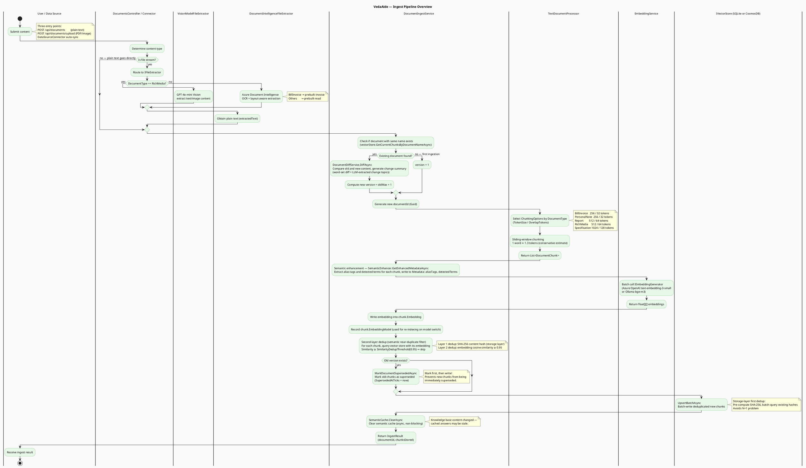
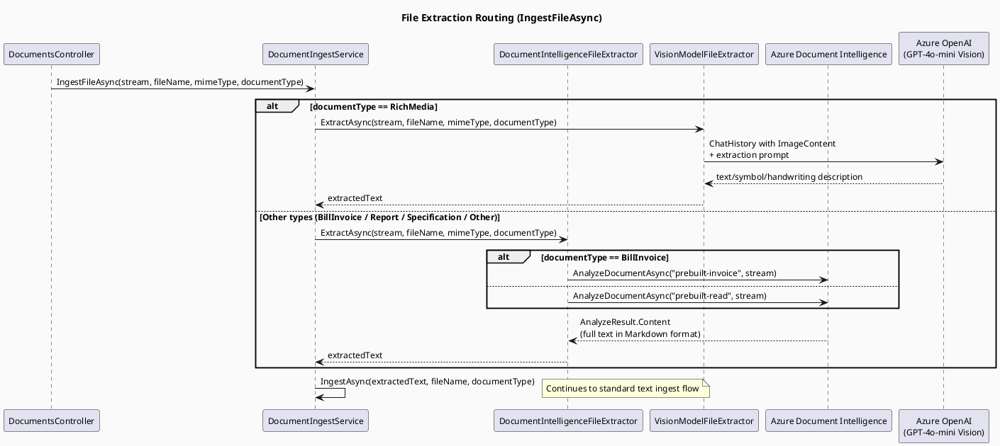
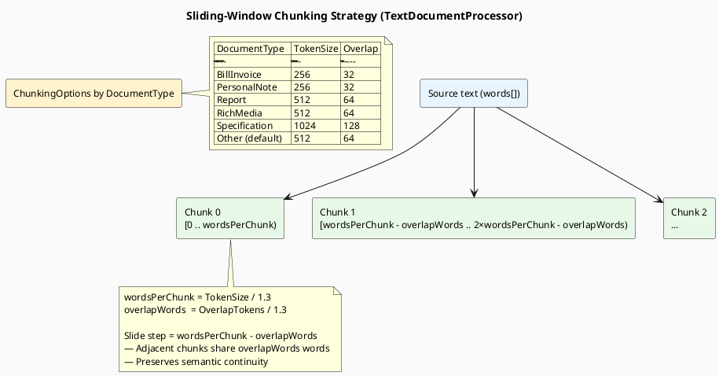
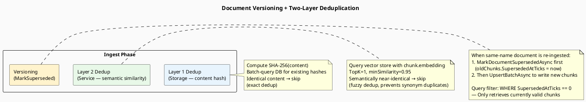
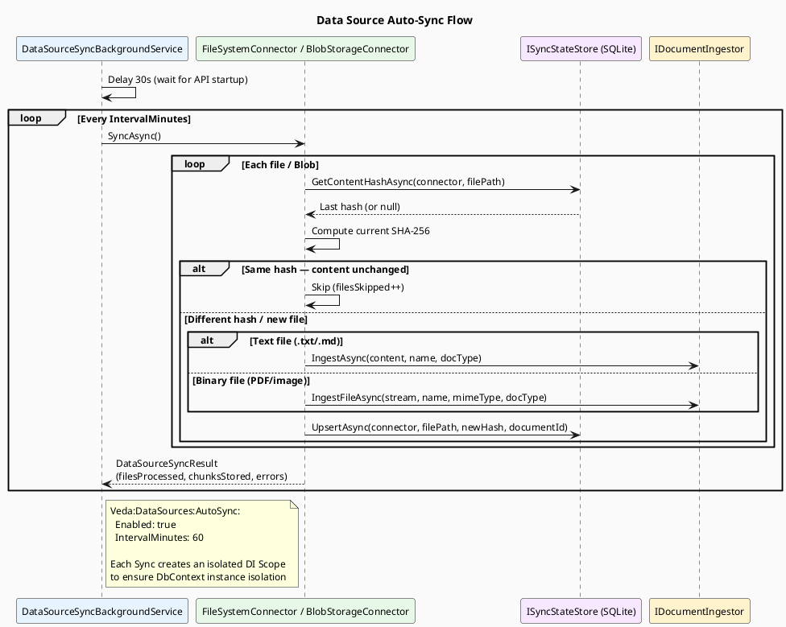

> **Viewing diagrams:** In browser, install [Markdown Diagrams](https://chromewebstore.google.com/detail/markdown-diagrams/mnfehgbmkaijmakeobbflcbldbbldmjh) extension; in VS Code, install [Markdown PlantUML Preview](https://marketplace.visualstudio.com/items?itemName=well-30.plantuml-markdown) plugin.

> 中文版：[02-ingest-flow.cn.md](02-ingest-flow.cn.md)

# 02 — Ingest Pipeline

> The complete journey of a document (text or file) into the VedaAide knowledge base.

---

### Semantic Enhancement (Detailed Explanation)

**Core Concept**: During ingestion, use a personal vocabulary configuration to automatically detect terms in chunks, then replace them in-place with "term (synonym1 synonym2)" format to enhance embedding semantic associations.

**Example Walkthrough**:

| Stage | Content |
|-------|---------|
| **Original chunk** | The BG is too dark, so James had to be very careful. |
| **Vocabulary** | term="BG", synonyms=["背景资料", "context"] |
| **After Enhancement** | The BG (背景资料 context) is too dark, so James had to be very careful. |
| **Stored Metadata** | aliasTags: [], detectedTerms: {"BG": ["背景资料", "context"]} |
| **For Embedding** | Full enriched text; embedding captures semantic associations between BG/背景资料/context |

**Advantages**:
- ✅ Syntax coherent, high-quality embedding semantics
- ✅ User queries with "background" or "背景资料" will retrieve this chunk (via embedding similarity)
- ✅ Original matched case is preserved (e.g., "BG" stays "BG", not "bg")
- ✅ Avoids double-replacement (already-replaced terms are not replaced again)

---

## 1. Overall Ingest Flow

---

## 2. File Extraction Routing

---

## 3. Chunking Strategy

---

## 4. Versioning & Deduplication

---

## 5. Data Source Auto-Sync

