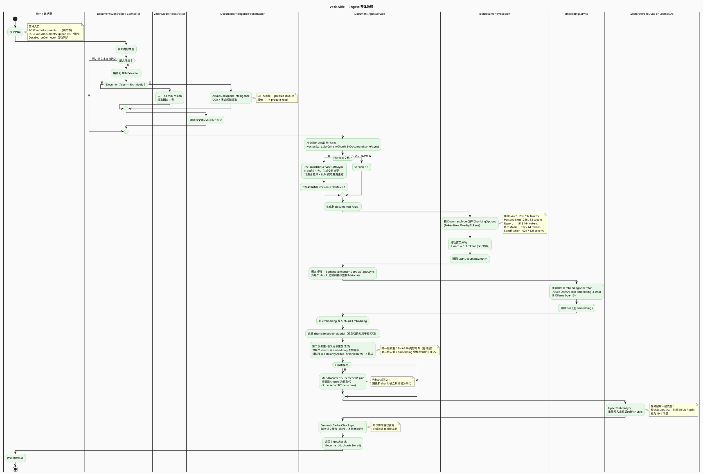
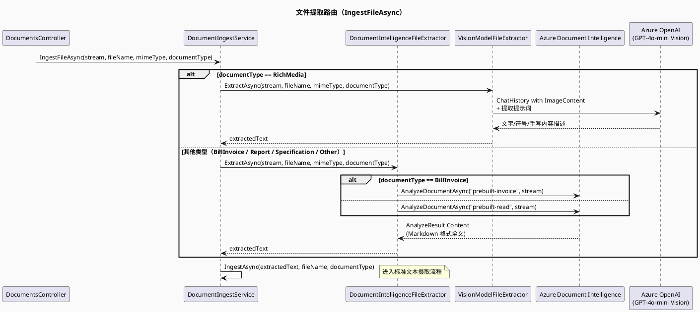
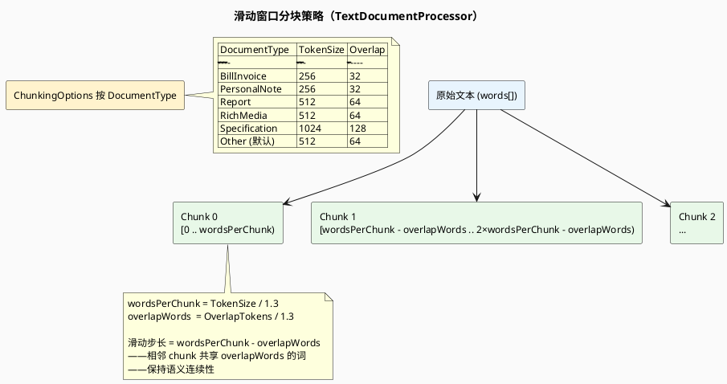
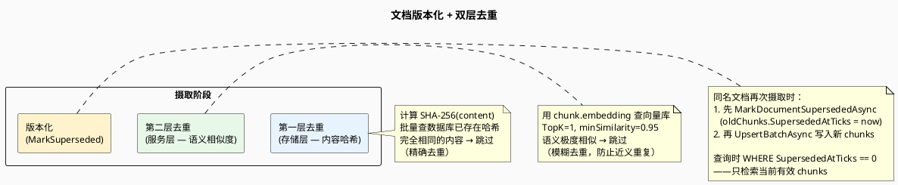
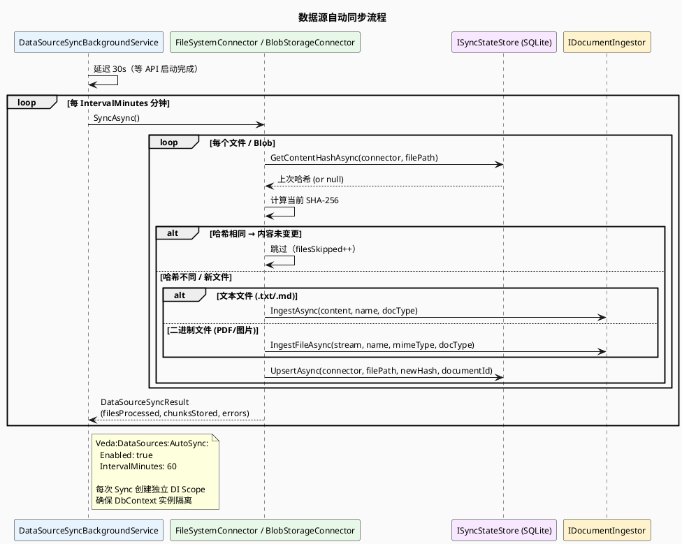

# 02 — Ingest 数据流

> 一个文档（文本或文件）如何进入 VedaAide 知识库的完整过程。

---

## 1. 整体流程图

---

## 2. 文件摄取路由细图

---

## 3. 分块策略详解

---

## 4. 版本控制与去重机制

---

## 5. 数据源自动同步

---

## 6. 关键代码位置速查

| 步骤 | 类 / 文件 | 方法 |
|------|-----------|------|
| HTTP 入口（文本） | `DocumentsController` | `Ingest()` |
| HTTP 入口（文件） | `DocumentsController` | `Upload()` |
| MCP 入口 | `IngestTools` | `IngestDocument()` |
| 主摄取流程 | `DocumentIngestService` | `IngestAsync()` |
| 文件提取路由 | `DocumentIngestService` | `IngestFileAsync()` |
| PDF/图片 OCR | `DocumentIntelligenceFileExtractor` | `ExtractAsync()` |
| 图文 Vision 提取 | `VisionModelFileExtractor` | `ExtractAsync()` |
| 分块 | `TextDocumentProcessor` | `Process()` |
| 分块配置 | `ChunkingOptions` | `ForDocumentType()` |
| 别名注入 | `PersonalVocabularyEnhancer` | `GetAliasTagsAsync()` |
| Embedding 生成 | `EmbeddingService` | `GenerateEmbeddingsAsync()` |
| 语义近似去重 | `DocumentIngestService` | `IngestAsync()` 内循环 |
| 版本标记 | `SqliteVectorStore` / `CosmosDbVectorStore` | `MarkDocumentSupersededAsync()` |
| 批量写入 | `SqliteVectorStore` / `CosmosDbVectorStore` | `UpsertBatchAsync()` |
| 缓存清除 | `SqliteSemanticCache` / `CosmosDbSemanticCache` | `ClearAsync()` |
| 版本对比 | `DocumentDiffService` | `DiffAsync()` |
| 自动同步调度 | `DataSourceSyncBackgroundService` | `ExecuteAsync()` |
