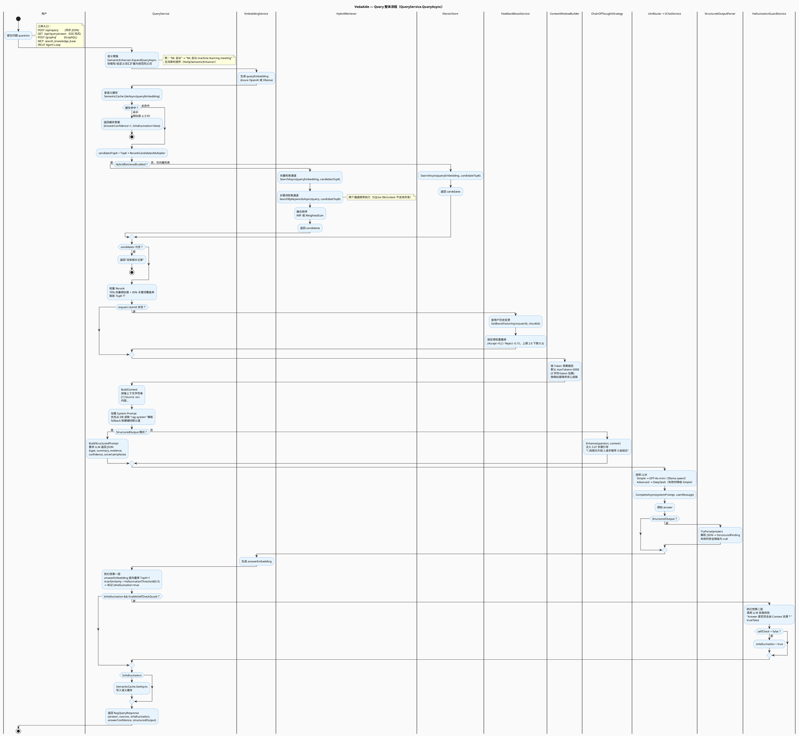
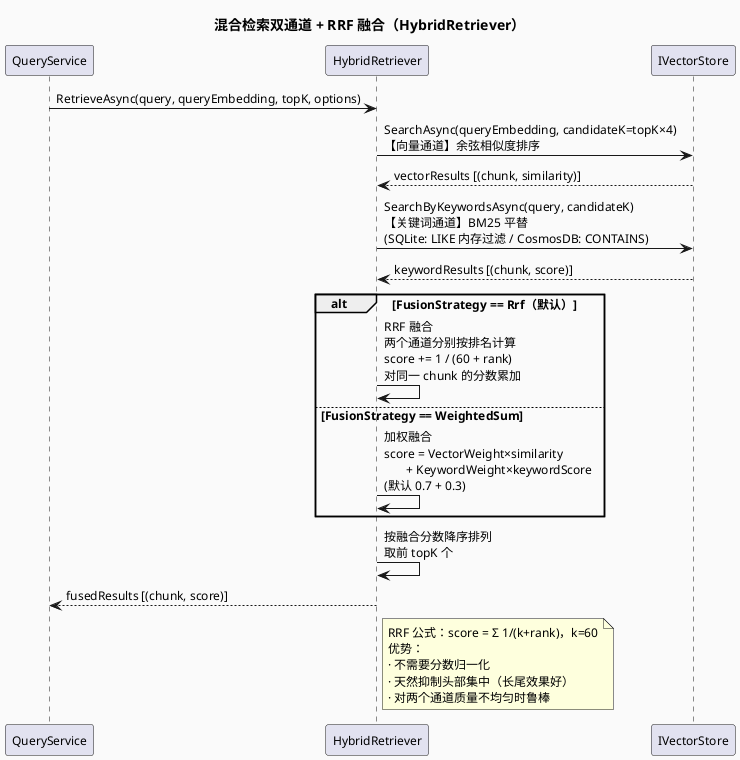
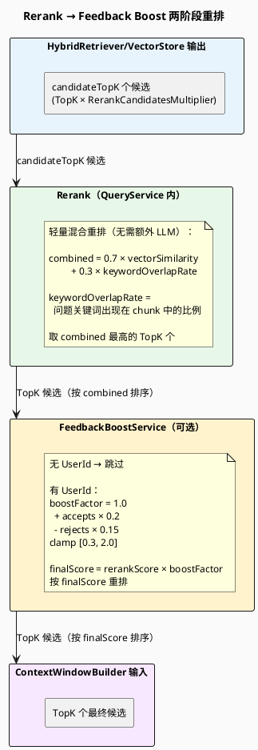
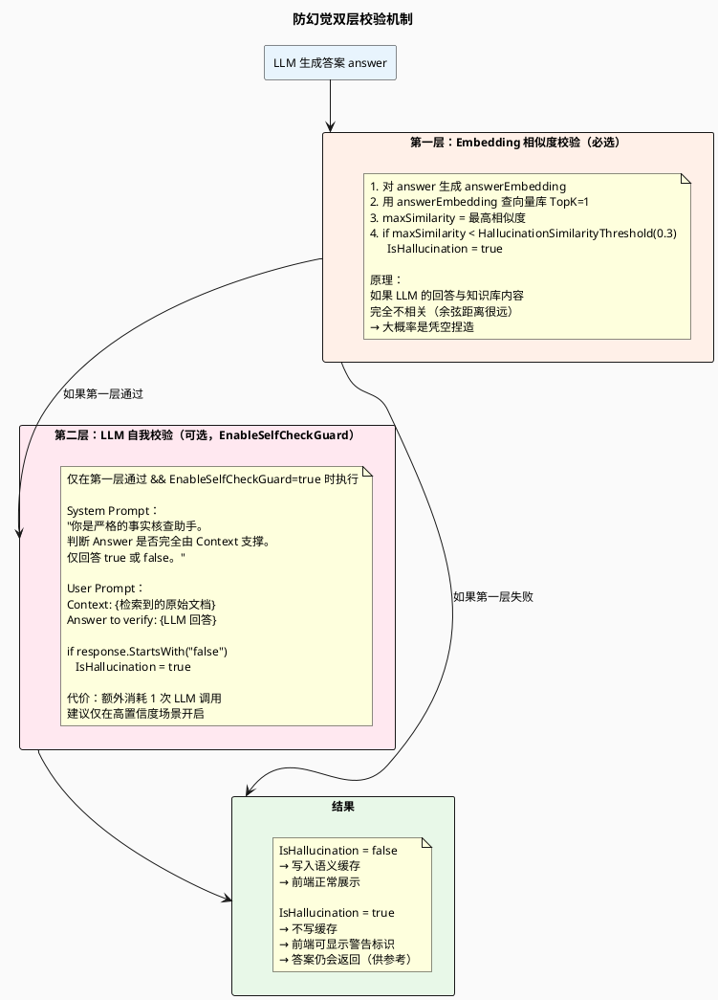
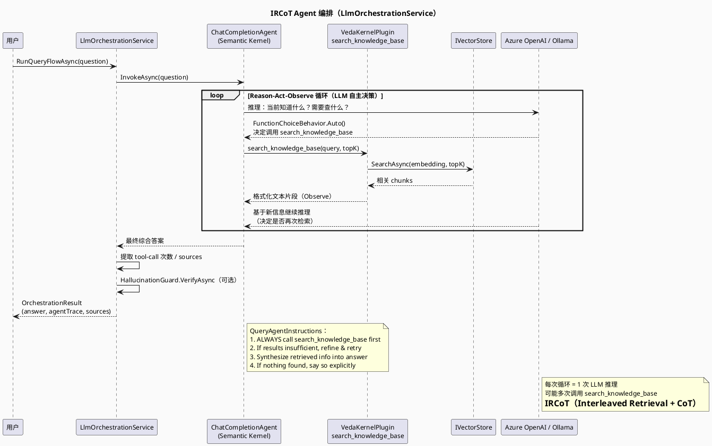
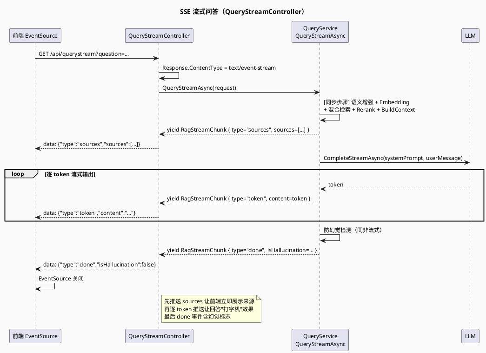

> **查看图表说明：** 浏览器安装 [Markdown Diagrams](https://chromewebstore.google.com/detail/markdown-diagrams/mnfehgbmkaijmakeobbflcbldbbldmjh) 扩展；VS Code 安装 [Markdown PlantUML Preview](https://marketplace.visualstudio.com/items?itemName=well-30.plantuml-markdown) 插件。

> English version: [03-query-flow.en.md](03-query-flow.en.md)

# 03 — Query 数据流

> 用户提问后，VedaAide 如何检索知识库、生成回答，并验证回答质量。

---

## 1. Query 整体流程图

---

## 2. 混合检索融合细图

---

## 3. Rerank + Feedback Boost 细图

---

## 4. 防幻觉双层校验

---

## 5. IRCoT Agent 模式（Phase 4）

---

## 6. 流式问答（SSE）

---

## 7. 关键代码位置速查

| 步骤 | 类 / 文件 | 方法 |
|------|-----------|------|
| HTTP 入口（同步） | `QueryController` | `Query()` |
| HTTP 入口（流式） | `QueryStreamController` | `Stream()` |
| GraphQL 入口 | `Veda.Api/GraphQL/Query` | `Query()` |
| MCP 入口 | `KnowledgeBaseTools` | `SearchKnowledgeBase()` |
| Agent 编排入口 | `LlmOrchestrationService` | `RunQueryFlowAsync()` |
| 主查询流程 | `QueryService` | `QueryAsync()` |
| 流式查询流程 | `QueryService` | `QueryStreamAsync()` |
| 查询扩展 | `PersonalVocabularyEnhancer` | `ExpandQueryAsync()` |
| 语义缓存命中 | `SqliteSemanticCache` / `CosmosDbSemanticCache` | `GetAsync()` |
| 混合检索 | `HybridRetriever` | `RetrieveAsync()` |
| RRF 融合 | `HybridRetriever` | `FuseRrf()` |
| 加权融合 | `HybridRetriever` | `FuseWeighted()` |
| 轻量 Rerank | `QueryService` | `Rerank()` |
| 反馈 Boost | `FeedbackBoostService` | `ApplyBoostAsync()` |
| Token 预算裁剪 | `ContextWindowBuilder` | `Build()` |
| CoT 注入 | `ChainOfThoughtStrategy` | `Enhance()` |
| 结构化 Prompt | `QueryService` | `BuildStructuredPrompt()` |
| LLM 路由 | `LlmRouterService` | `Resolve()` |
| Chat 适配器 | `OllamaChatService` | `CompleteAsync()` / `CompleteStreamAsync()` |
| 结构化输出解析 | `StructuredOutputParser` | `TryParse()` |
| 防幻觉第一层 | `QueryService` | `QueryAsync()` 内 |
| 防幻觉第二层 | `HallucinationGuardService` | `VerifyAsync()` |
| 语义缓存写入 | `SqliteSemanticCache` / `CosmosDbSemanticCache` | `SetAsync()` |
| IRCoT Agent | `LlmOrchestrationService` | `RunQueryFlowAsync()` |
| SK Plugin | `VedaKernelPlugin` | `SearchKnowledgeBaseAsync()` |
