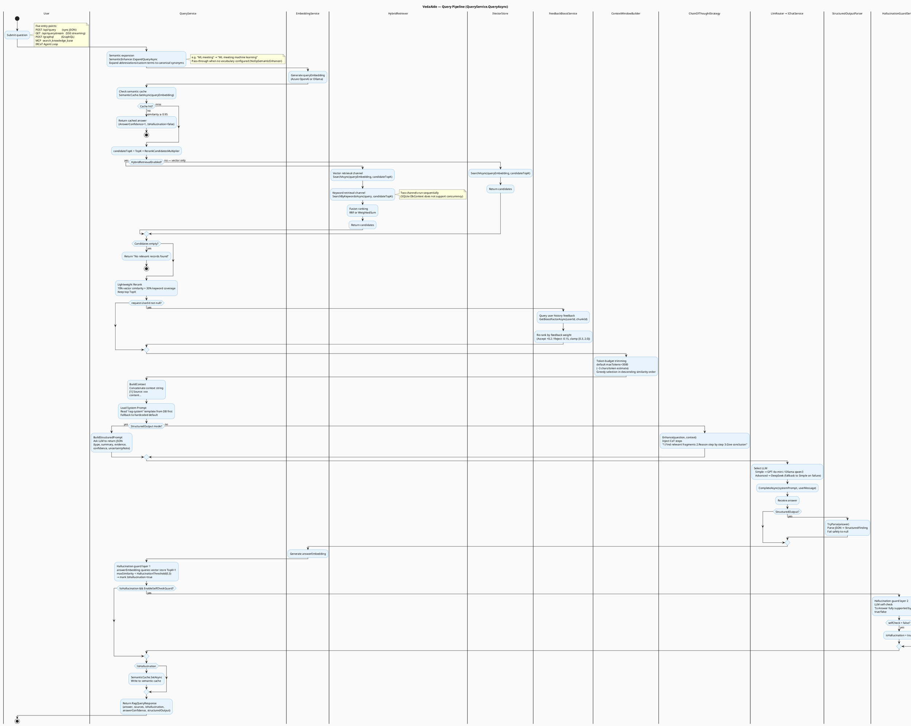
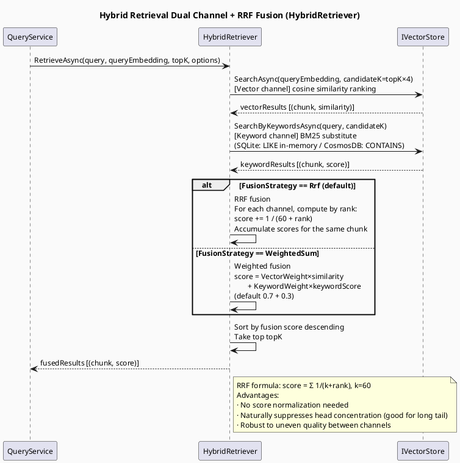
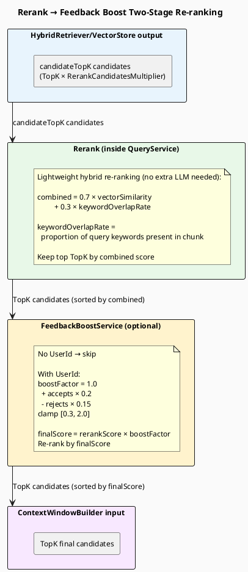
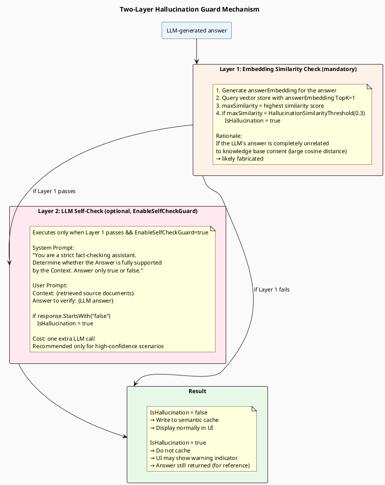
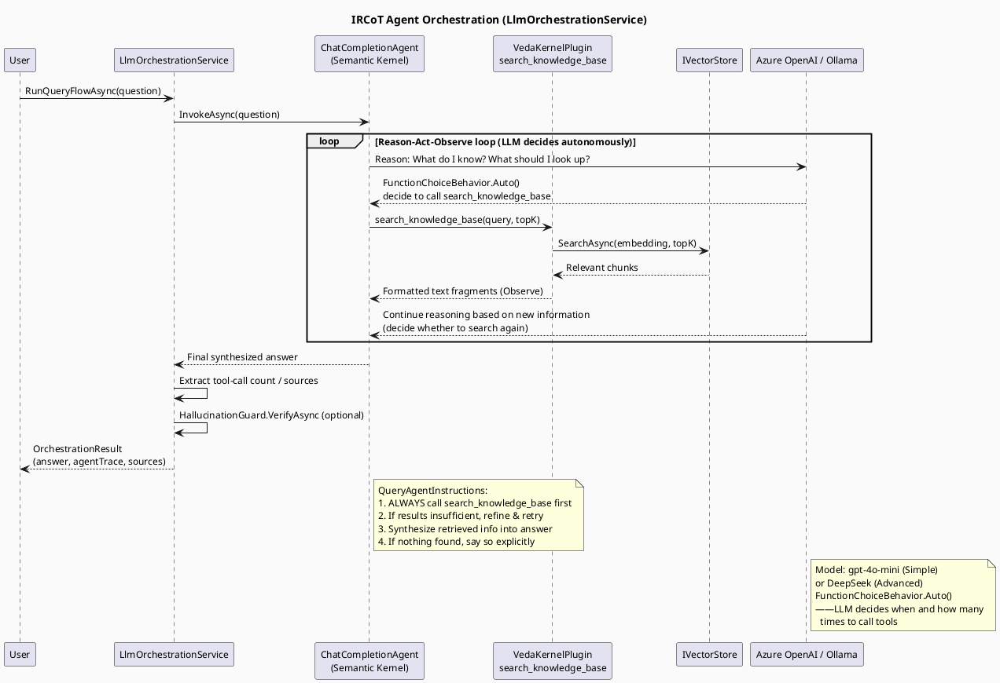

> **Viewing diagrams:** In browser, install [Markdown Diagrams](https://chromewebstore.google.com/detail/markdown-diagrams/mnfehgbmkaijmakeobbflcbldbbldmjh) extension; in VS Code, install [Markdown PlantUML Preview](https://marketplace.visualstudio.com/items?itemName=well-30.plantuml-markdown) plugin.

> 中文版：[03-query-flow.cn.md](03-query-flow.cn.md)

# 03 — Query Pipeline

> How VedaAide retrieves knowledge, generates an answer, and validates answer quality after a user asks a question.

---

## 1. Query Pipeline Overview

---

## 2. Hybrid Retrieval Fusion

---

## 3. Rerank + Feedback Boost

---

## 4. Two-Layer Hallucination Guard

---

## 5. IRCoT Agent Mode (Phase 4)

