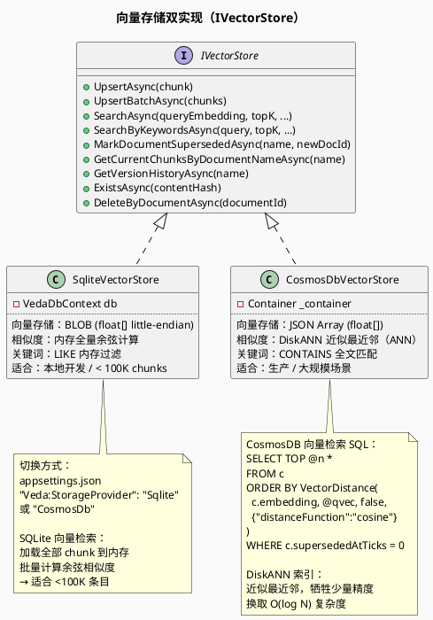
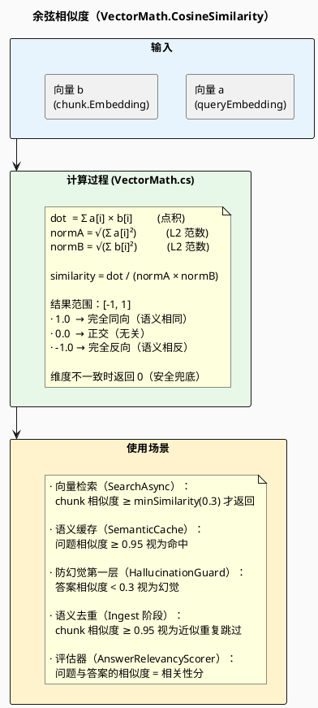
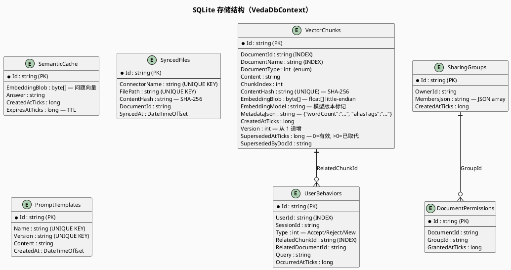
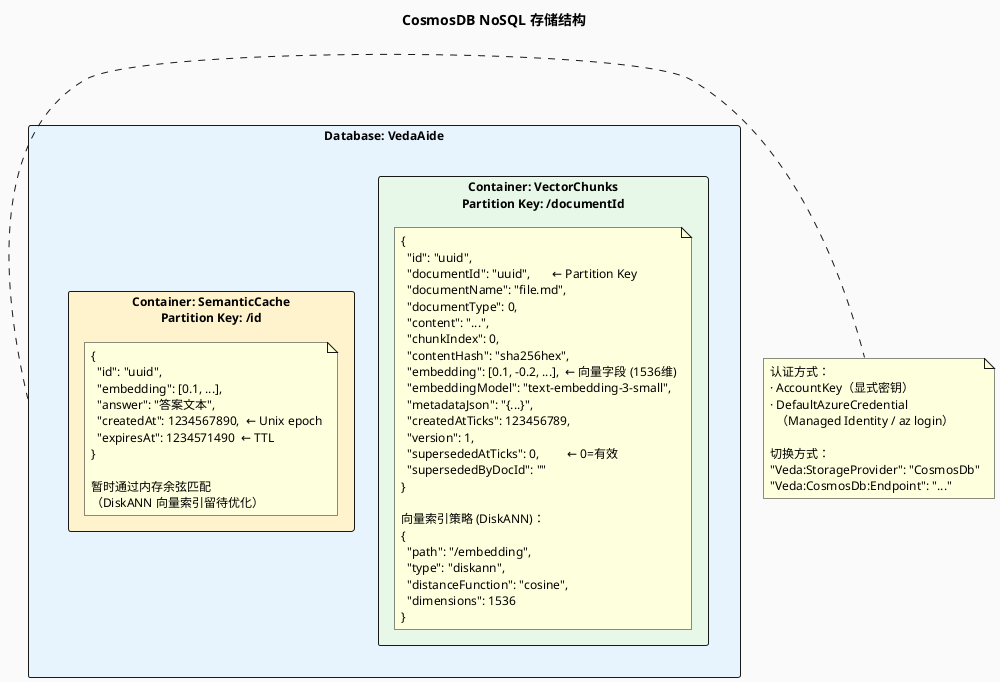
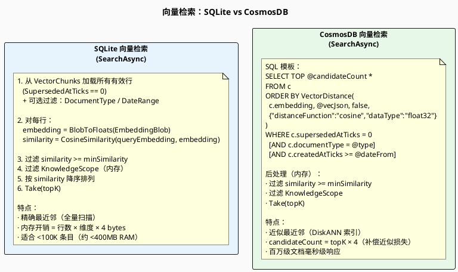
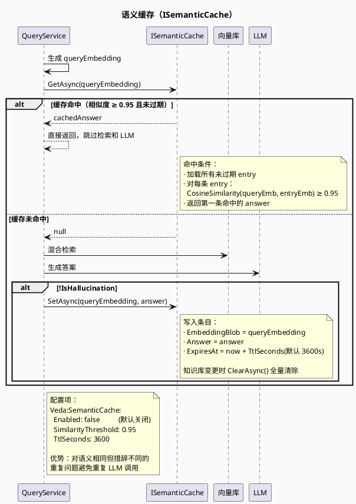

> **查看图表说明：** 浏览器安装 [Markdown Diagrams](https://chromewebstore.google.com/detail/markdown-diagrams/mnfehgbmkaijmakeobbflcbldbbldmjh) 扩展；VS Code 安装 [Markdown PlantUML Preview](https://marketplace.visualstudio.com/items?itemName=well-30.plantuml-markdown) 插件。

> English version: [04-storage-retrieval.en.md](04-storage-retrieval.en.md)

# 04 — 存储层与向量检索

> 覆盖两套向量存储实现（SQLite / CosmosDB）、余弦相似度计算原理、关键词检索，以及语义缓存机制。

---

## 1. 存储层双实现对比

---

## 2. 余弦相似度计算原理

---

## 3. SQLite 存储结构

---

## 4. CosmosDB 存储结构

---

## 5. 向量检索全流程对比

---

## 6. 语义缓存工作原理

---

## 7. 关键参数与阈值速查

| 参数 | 默认值 | 含义 | 配置路径 |
|------|--------|------|---------|
| `minSimilarity` | 0.3 | 检索时过滤相似度下限 | `Veda:Rag:DefaultMinSimilarity` |
| `topK` | 5 | 最终返回的 chunk 数量 | 请求参数 |
| `RerankCandidatesMultiplier` | 见代码 | candidateTopK = topK × 倍数 | 代码常量 |
| `SimilarityDedupThreshold` | 0.95 | 摄取阶段语义去重阈值 | `Veda:Rag:SimilarityDedupThreshold` |
| `HallucinationSimilarityThreshold` | 0.3 | 防幻觉第一层阈值 | `Veda:Rag:HallucinationSimilarityThreshold` |
| `SemanticCache.SimilarityThreshold` | 0.95 | 缓存命中相似度阈值 | `Veda:SemanticCache:SimilarityThreshold` |
| `SemanticCache.TtlSeconds` | 3600 | 缓存 TTL（秒） | `Veda:SemanticCache:TtlSeconds` |
| `VectorWeight` | 0.7 | 混合检索向量通道权重 | `Veda:Rag:VectorWeight` |
| `KeywordWeight` | 0.3 | 混合检索关键词通道权重 | `Veda:Rag:KeywordWeight` |
| `FusionStrategy` | Rrf | 融合策略（Rrf / WeightedSum） | `Veda:Rag:FusionStrategy` |
| `EmbeddingDimensions` | 1536 | CosmosDB DiskANN 向量维度 | `Veda:CosmosDb:EmbeddingDimensions` |
| `ContextWindowBuilder.maxTokens` | 3000 | LLM 上下文 Token 预算 | 代码默认值 |
