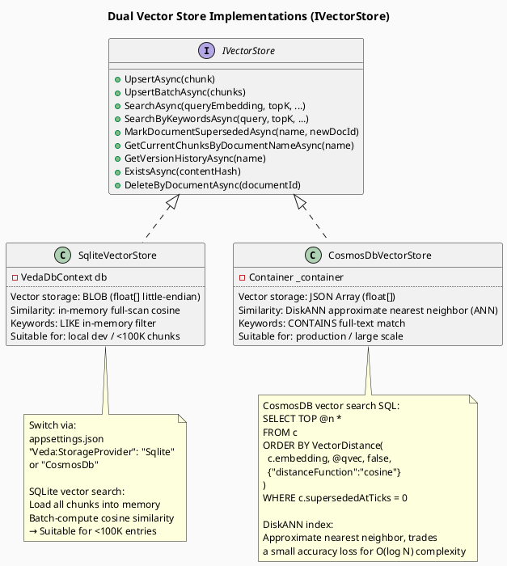
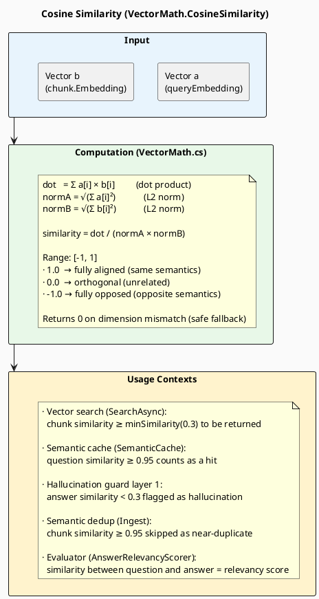
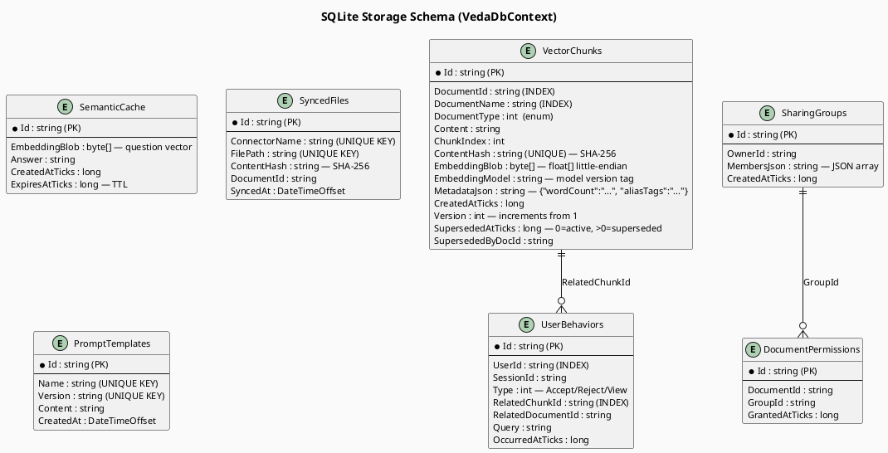
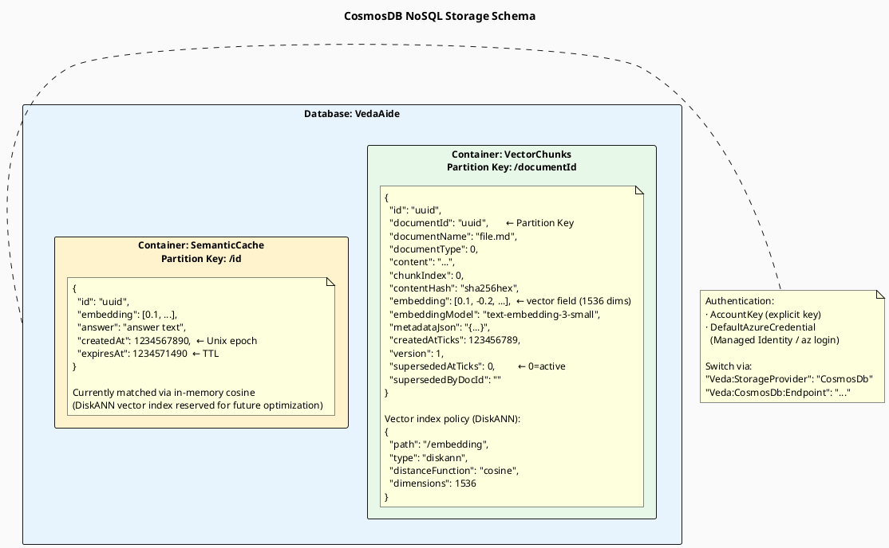
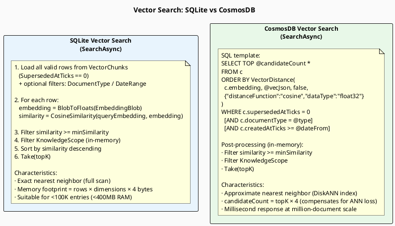
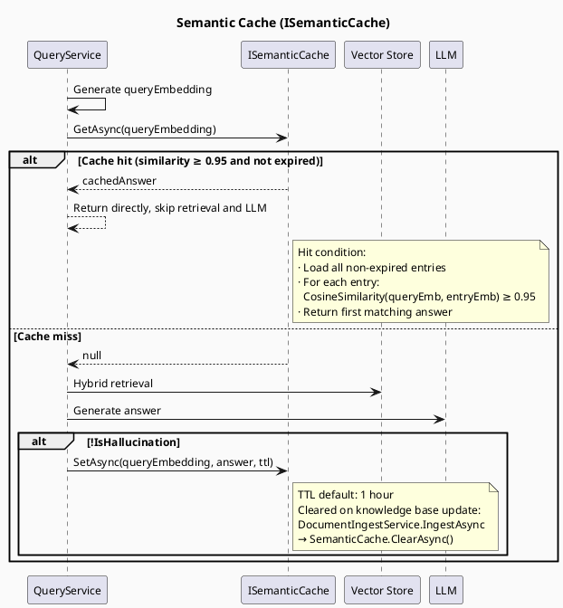

> **Viewing diagrams:** In browser, install [Markdown Diagrams](https://chromewebstore.google.com/detail/markdown-diagrams/mnfehgbmkaijmakeobbflcbldbbldmjh) extension; in VS Code, install [Markdown PlantUML Preview](https://marketplace.visualstudio.com/items?itemName=well-30.plantuml-markdown) plugin.

> 中文版：[04-storage-retrieval.cn.md](04-storage-retrieval.cn.md)

# 04 — Storage Layer & Vector Retrieval

> Covers both vector store implementations (SQLite / CosmosDB), cosine similarity computation, keyword retrieval, and the semantic cache mechanism.

---

## 1. Dual Storage Implementation Comparison

---

## 2. Cosine Similarity Computation

---

## 3. SQLite Storage Schema

---

## 4. CosmosDB Storage Schema

---

## 5. Vector Search Comparison: SQLite vs CosmosDB

---

## 6. Semantic Cache Operation

