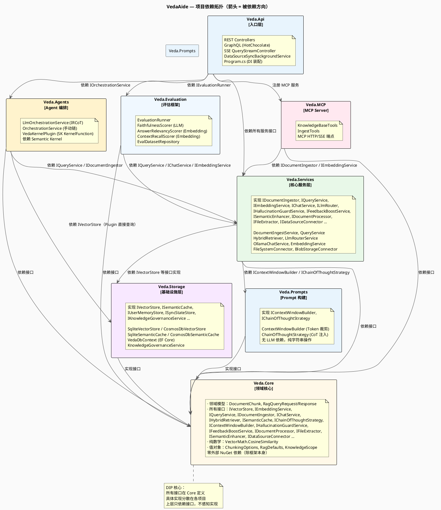
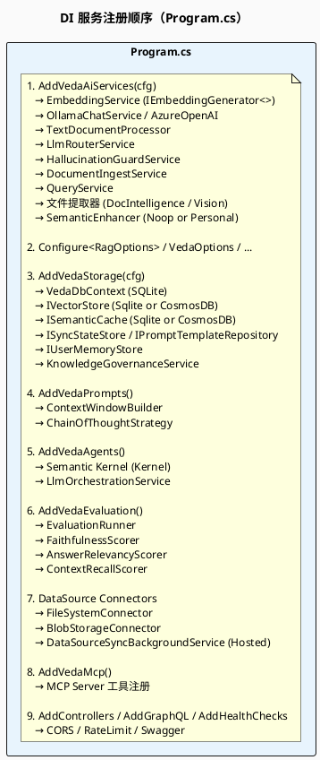
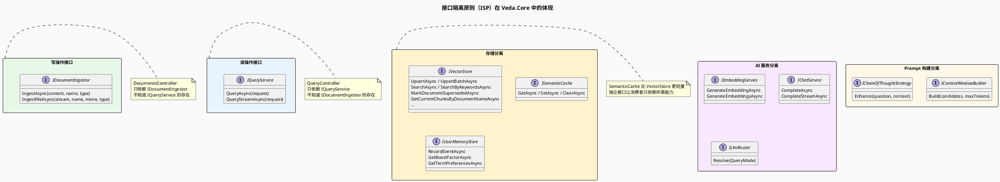

> **查看图表说明：** 浏览器安装 [Markdown Diagrams](https://chromewebstore.google.com/detail/markdown-diagrams/mnfehgbmkaijmakeobbflcbldbbldmjh) 扩展；VS Code 安装 [Markdown PlantUML Preview](https://marketplace.visualstudio.com/items?itemName=well-30.plantuml-markdown) 插件。

> English version: [06-module-dependencies.en.md](06-module-dependencies.en.md)

# 06 — 模块依赖拓扑

> VedaAide 各 C# 项目之间的依赖关系，以及 SOLID 原则在项目边界上的体现。

---

## 1. 项目依赖拓扑图

---

## 2. DI 注册流程（Program.cs 装配顺序）

---

## 3. 接口隔离（ISP）体现

---

## 4. 可插拔扩展点一览

| 扩展点 | 当前实现 | 可替换为 | 切换方式 |
|--------|---------|---------|---------|
| 向量存储 | `SqliteVectorStore` | `CosmosDbVectorStore` / Azure AI Search | `Veda:StorageProvider` 配置 |
| Embedding 模型 | `bge-m3` (Ollama) | `text-embedding-3-small` (Azure OpenAI) | `Veda:EmbeddingProvider` 配置 |
| Chat 模型 (Simple) | `qwen3:8b` (Ollama) | `gpt-4o-mini` (Azure OpenAI) | `Veda:LlmProvider` 配置 |
| Chat 模型 (Advanced) | `deepseek-chat` | 任何 OpenAI 兼容端点 | `Veda:DeepSeek:*` 配置 |
| 文件提取（普通） | `DocumentIntelligenceFileExtractor` | 其他 OCR 服务 | 实现 `IFileExtractor` |
| 文件提取（图文） | `VisionModelFileExtractor` | 其他 Vision 模型 | 实现 `IFileExtractor` |
| 分块策略 | `TextDocumentProcessor` | AST-aware / Markdown-aware 分块器 | 实现 `IDocumentProcessor` |
| 语义增强 | `NoOpSemanticEnhancer` / `PersonalVocabularyEnhancer` | LLM 主动扩展 | 实现 `ISemanticEnhancer` |
| 重排序 | 轻量关键词覆盖率 | Cross-encoder 模型 | 修改 `QueryService.Rerank()` |
| Prompt 模板 | 硬编码 fallback / DB 动态 | 任何模板存储 | `IPromptTemplateRepository` |
| 数据源 | `FileSystemConnector` / `BlobStorageConnector` | SharePoint / Notion / 数据库 | 实现 `IDataSourceConnector` |
| Agent 编排 | 手动链 `OrchestrationService` / IRCoT `LlmOrchestrationService` | Multi-agent群组 | 实现 `IOrchestrationService` |
