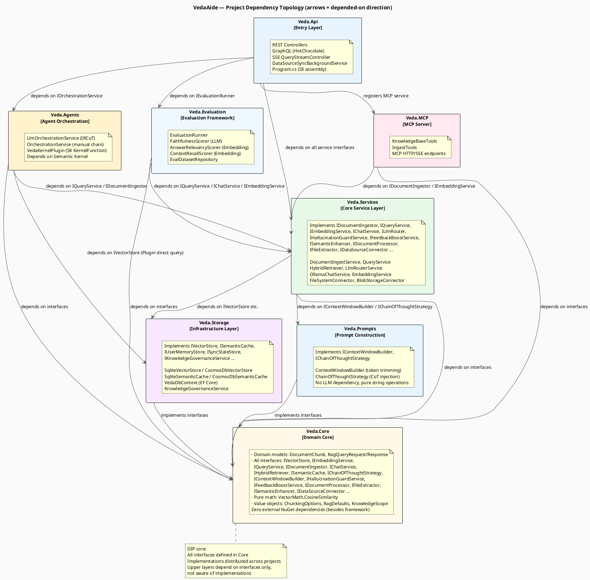
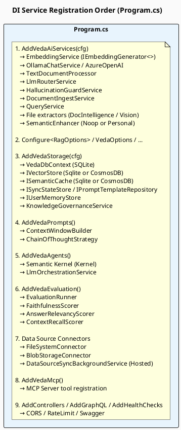

> **Viewing diagrams:** In browser, install [Markdown Diagrams](https://chromewebstore.google.com/detail/markdown-diagrams/mnfehgbmkaijmakeobbflcbldbbldmjh) extension; in VS Code, install [Markdown PlantUML Preview](https://marketplace.visualstudio.com/items?itemName=well-30.plantuml-markdown) plugin.

> 中文版：[06-module-dependencies.cn.md](06-module-dependencies.cn.md)

# 06 — Module Dependency Topology

> Dependencies between VedaAide C# projects, and how SOLID principles manifest at project boundaries.

---

## 1. Project Dependency Topology

---

## 2. DI Registration Flow (Program.cs assembly order)

---

## 3. Interface Segregation at Project Boundaries

| Interface Package | Defined In | Implemented In | Used By |
|------------------|-----------|----------------|---------|
| `IVectorStore` | `Veda.Core` | `Veda.Storage` | `Veda.Services`, `Veda.Agents` |
| `ISemanticCache` | `Veda.Core` | `Veda.Storage` | `Veda.Services` |
| `IEmbeddingService` | `Veda.Core` | `Veda.Services` | `Veda.Services`, `Veda.Evaluation`, `Veda.MCP` |
| `IQueryService` | `Veda.Core` | `Veda.Services` | `Veda.Agents`, `Veda.Evaluation`, `Veda.Api` |
| `IDocumentIngestor` | `Veda.Core` | `Veda.Services` | `Veda.Agents`, `Veda.MCP`, `Veda.Api` |
| `IChatService` | `Veda.Core` | `Veda.Services` | `Veda.Services` (via LlmRouter), `Veda.Evaluation` |
| `IContextWindowBuilder` | `Veda.Core` | `Veda.Prompts` | `Veda.Services` |
| `IChainOfThoughtStrategy` | `Veda.Core` | `Veda.Prompts` | `Veda.Services` |
| `IHallucinationGuardService` | `Veda.Core` | `Veda.Services` | `Veda.Services`, `Veda.Agents` |
| `IDataSourceConnector` | `Veda.Core` | `Veda.Services` | `Veda.Api` (via BgService) |
| `IEvaluationRunner` | `Veda.Core` | `Veda.Evaluation` | `Veda.Api` |
| `IOrchestrationService` | `Veda.Core` | `Veda.Agents` | `Veda.Api` |
