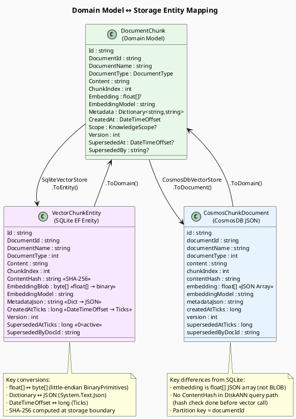

> **Viewing diagrams:** In browser, install [Markdown Diagrams](https://chromewebstore.google.com/detail/markdown-diagrams/mnfehgbmkaijmakeobbflcbldbbldmjh) extension; in VS Code, install [Markdown PlantUML Preview](https://marketplace.visualstudio.com/items?itemName=well-30.plantuml-markdown) plugin.

> 中文版：[07-data-model-er.cn.md](07-data-model-er.cn.md)

# 07 — Data Model ER Diagram

> Complete entity-relationship diagram for the VedaAide SQLite database, and the mapping between domain models (in-memory objects) and storage entities.

---

## 1. SQLite Complete ER Diagram

```plantuml
@startuml er-diagram
skinparam backgroundColor #FAFAFA
skinparam defaultFontSize 11
skinparam linetype ortho

title VedaAide — SQLite Data Model ER Diagram

entity "VectorChunks\n(Vector Storage)" as VC #E8F8E8 {
  * id : TEXT (PK)
  --
  documentId : TEXT (INDEX)
  documentName : TEXT (INDEX)
  documentType : INTEGER  «enum DocumentType»
  content : TEXT
  chunkIndex : INTEGER
  contentHash : TEXT (UNIQUE) «SHA-256»
  embeddingBlob : BLOB  «float[] little-endian»
  embeddingModel : TEXT  «bge-m3 / text-embedding-3-small»
  metadataJson : TEXT  «{"wordCount":"n", "aliasTags":"..."}»
  createdAtTicks : INTEGER  «UTC ticks»
  version : INTEGER  «increments from 1»
  supersededAtTicks : INTEGER  «0=active, >0=superseded»
  supersededByDocId : TEXT
}

entity "SemanticCacheEntries\n(Semantic Cache)" as SC #FFF3CD {
  * id : TEXT (PK)
  --
  embeddingBlob : BLOB  «question vector»
  answer : TEXT
  createdAtTicks : INTEGER
  expiresAtTicks : INTEGER  «TTL»
}

entity "UserBehaviors\n(User Behavior)" as UB #E8F4FD {
  * id : TEXT (PK)
  --
  userId : TEXT (INDEX)
  sessionId : TEXT
  type : INTEGER  «enum BehaviorType»
  relatedChunkId : TEXT (INDEX)
  relatedDocumentId : TEXT
  query : TEXT
  occurredAtTicks : INTEGER
}

entity "SyncedFiles\n(Data Source Sync State)" as SF #F8E8FF {
  * id : TEXT (PK)
  --
  connectorName : TEXT (UNIQUE KEY)
  filePath : TEXT (UNIQUE KEY)
  contentHash : TEXT  «SHA-256»
  documentId : TEXT
  syncedAt : INTEGER
}

entity "PromptTemplates\n(Prompt Templates)" as PT #FFF8E8 {
  * id : TEXT (PK)
  --
  name : TEXT (UNIQUE KEY)
  version : TEXT (UNIQUE KEY)
  content : TEXT
  createdAt : INTEGER
}

entity "EvalQuestions\n(Evaluation Question Set)" as EQ #F0F8FF {
  * id : TEXT (PK)
  --
  question : TEXT
  expectedAnswer : TEXT
  tagsJson : TEXT  «["tag1","tag2"]»
  createdAt : INTEGER
}

entity "EvalRuns\n(Evaluation Run Records)" as ER {
  * runId : TEXT (PK)
  --
  modelName : TEXT
  reportJson : TEXT  «JSON-serialized EvaluationReport»
  createdAt : INTEGER
}

entity "SharingGroups\n(Knowledge Sharing Groups)" as SG #FFE8F0 {
  * id : TEXT (PK)
  --
  ownerId : TEXT
  membersJson : TEXT  «["userId1","userId2"]»
  createdAtTicks : INTEGER
}

entity "DocumentPermissions\n(Document Authorization)" as DP #FFE8F0 {
  * id : TEXT (PK)
  --
  documentId : TEXT
  groupId : TEXT (FK → SharingGroups)
  grantedAtTicks : INTEGER
}

entity "ConsensusCandidates\n(Consensus Knowledge Candidates)" as CC #F0F8E8 {
  * id : TEXT (PK)
  --
  anonymizedPattern : TEXT
  nominatedByUserId : TEXT
  nominatedAtTicks : INTEGER
  voteCount : INTEGER
  status : INTEGER  «Pending/Approved/Rejected»
}

' Relationships
VC ||--o{ UB : "relatedChunkId\n(behavior records reference chunk)"
SG ||--o{ DP : "groupId\n(group owns multiple permissions)"

note right of VC
  Versioning design:
  When a same-name document is re-ingested,
  the old chunks' supersededAtTicks is set to now,
  new chunks are written in with incremented version.
  Query filters supersededAtTicks == 0
  to ensure only the latest version is returned.
end note

note right of UB
  BehaviorType enum:
  · ResultAccepted (0) — user accepted answer
  · ResultRejected (1) — user rejected answer
  · DocumentViewed (2) — viewed document

  Boost calculation:
  boost = 1.0 + accepts×0.2 - rejects×0.15
  clamp [0.3, 2.0]
end note

note right of SF
  Incremental sync key:
  Each (connectorName, filePath) has one record
  Stores the SHA-256 hash from last sync
  On next sync, compare hashes — skip if same
end note

@enduml
```



---

## 2. Domain Model (In-Memory) ↔ Storage Entity Mapping



---

## 3. DocumentType Enum

| Value | Name | Typical Source | Chunking |
|-------|------|---------------|---------|
| 0 | `Other` | General text | 512 / 64 tokens |
| 1 | `PersonalNote` | User notes, diary | 256 / 32 tokens |
| 2 | `Report` | Business reports, analysis | 512 / 64 tokens |
| 3 | `Specification` | Tech specs, API docs | 1024 / 128 tokens |
| 4 | `BillInvoice` | Invoice, receipt | 256 / 32 tokens |
| 5 | `RichMedia` | Image, scanned PDF (via Vision) | 512 / 64 tokens |

---

## 4. KnowledgeScope Value Object

```csharp
// Veda.Core — used to isolate knowledge per user/group
record KnowledgeScope(string Domain, string OwnerId)
{
    // Special scope: ignore scope filter, return all
    public static readonly KnowledgeScope Global = new("*", "*");
}
```

Queries that pass a non-Global scope filter: only return chunks where the document's `ownerId` matches or the user is a member of an authorized `SharingGroup`.
