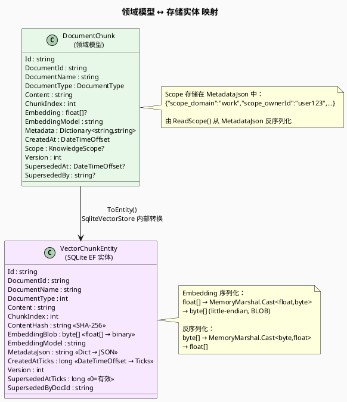
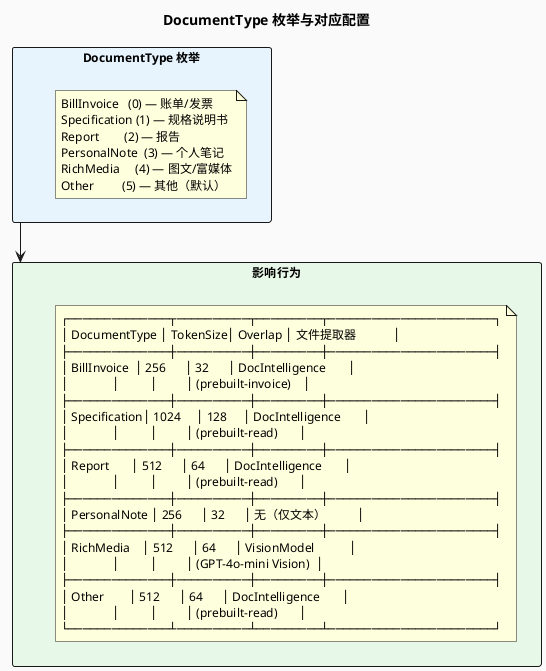
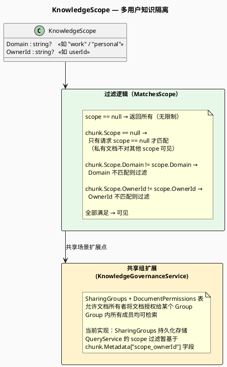

# 07 — 数据模型 ER 图

> VedaAide SQLite 数据库的完整实体关系图，以及领域模型（内存对象）与存储实体的映射关系。

---

## 1. SQLite 完整 ER 图

```plantuml
@startuml er-diagram
skinparam backgroundColor #FAFAFA
skinparam defaultFontSize 11
skinparam linetype ortho

title VedaAide — SQLite 数据模型 ER 图

entity "VectorChunks\n(向量存储)" as VC #E8F8E8 {
  * id : TEXT (PK)
  --
  documentId : TEXT (INDEX)
  documentName : TEXT (INDEX)
  documentType : INTEGER  «enum DocumentType»
  content : TEXT
  chunkIndex : INTEGER
  contentHash : TEXT (UNIQUE) «SHA-256»
  embeddingBlob : BLOB  «float[] little-endian»
  embeddingModel : TEXT  «bge-m3 / text-embedding-3-small»
  metadataJson : TEXT  «{"wordCount":"n", "aliasTags":"..."}»
  createdAtTicks : INTEGER  «UTC ticks»
  version : INTEGER  «从 1 递增»
  supersededAtTicks : INTEGER  «0=有效, >0=已取代»
  supersededByDocId : TEXT
}

entity "SemanticCacheEntries\n(语义缓存)" as SC #FFF3CD {
  * id : TEXT (PK)
  --
  embeddingBlob : BLOB  «问题向量»
  answer : TEXT
  createdAtTicks : INTEGER
  expiresAtTicks : INTEGER  «TTL»
}

entity "UserBehaviors\n(用户行为)" as UB #E8F4FD {
  * id : TEXT (PK)
  --
  userId : TEXT (INDEX)
  sessionId : TEXT
  type : INTEGER  «enum BehaviorType»
  relatedChunkId : TEXT (INDEX)
  relatedDocumentId : TEXT
  query : TEXT
  occurredAtTicks : INTEGER
}

entity "SyncedFiles\n(数据源同步状态)" as SF #F8E8FF {
  * id : TEXT (PK)
  --
  connectorName : TEXT (UNIQUE KEY)
  filePath : TEXT (UNIQUE KEY)
  contentHash : TEXT  «SHA-256»
  documentId : TEXT
  syncedAt : INTEGER
}

entity "PromptTemplates\n(提示词模板)" as PT #FFF8E8 {
  * id : TEXT (PK)
  --
  name : TEXT (UNIQUE KEY)
  version : TEXT (UNIQUE KEY)
  content : TEXT
  createdAt : INTEGER
}

entity "EvalQuestions\n(评估问题集)" as EQ #F0F8FF {
  * id : TEXT (PK)
  --
  question : TEXT
  expectedAnswer : TEXT
  tagsJson : TEXT  «["tag1","tag2"]»
  createdAt : INTEGER
}

entity "EvalRuns\n(评估运行记录)" as ER {
  * runId : TEXT (PK)
  --
  modelName : TEXT
  reportJson : TEXT  «JSON 序列化 EvaluationReport»
  createdAt : INTEGER
}

entity "SharingGroups\n(知识共享组)" as SG #FFE8F0 {
  * id : TEXT (PK)
  --
  ownerId : TEXT
  membersJson : TEXT  «["userId1","userId2"]»
  createdAtTicks : INTEGER
}

entity "DocumentPermissions\n(文档授权)" as DP #FFE8F0 {
  * id : TEXT (PK)
  --
  documentId : TEXT
  groupId : TEXT (FK → SharingGroups)
  grantedAtTicks : INTEGER
}

entity "ConsensusCandidates\n(共识知识候选)" as CC #F0F8E8 {
  * id : TEXT (PK)
  --
  anonymizedPattern : TEXT
  nominatedByUserId : TEXT
  nominatedAtTicks : INTEGER
  voteCount : INTEGER
  status : INTEGER  «Pending/Approved/Rejected»
}

' 关系
VC ||--o{ UB : "relatedChunkId\n(行为记录关联 chunk)"
SG ||--o{ DP : "groupId\n(组拥有多条授权)"

note right of VC
  版本化设计：
  同名文档再次摄取时，
  旧 chunk 的 supersededAtTicks 被设置为当前时间，
  新 chunk 写入，version 递增。
  查询时过滤 supersededAtTicks == 0
  确保只返回最新版本。
end note

note right of UB
  BehaviorType 枚举：
  · ResultAccepted (0) — 用户接受答案
  · ResultRejected (1) — 用户拒绝答案
  · DocumentViewed (2) — 查看文档

  boost 计算：
  boost = 1.0 + accepts×0.2 - rejects×0.15
  clamp [0.3, 2.0]
end note

note right of SF
  增量同步核心：
  每个 (connectorName, filePath) 唯一记录
  记录上次同步的 SHA-256 哈希
  下次同步时对比哈希，相同则跳过
end note

@enduml
```

---

## 2. 领域模型（内存）与存储实体映射

```plantuml
@startuml domain-entity-mapping
skinparam backgroundColor #FAFAFA
skinparam defaultFontSize 11

title 领域模型 ↔ 存储实体 映射

class "DocumentChunk\n(领域模型)" as DC #E8F8E8 {
  Id : string
  DocumentId : string
  DocumentName : string
  DocumentType : DocumentType
  Content : string
  ChunkIndex : int
  Embedding : float[]?
  EmbeddingModel : string
  Metadata : Dictionary<string,string>
  CreatedAt : DateTimeOffset
  Scope : KnowledgeScope?
  Version : int
  SupersededAt : DateTimeOffset?
  SupersededBy : string?
}

class "VectorChunkEntity\n(SQLite EF 实体)" as VCE #F8E8FF {
  Id : string
  DocumentId : string
  DocumentName : string
  DocumentType : int
  Content : string
  ChunkIndex : int
  ContentHash : string «SHA-256»
  EmbeddingBlob : byte[] «float[] → binary»
  EmbeddingModel : string
  MetadataJson : string «Dict → JSON»
  CreatedAtTicks : long «DateTimeOffset → Ticks»
  Version : int
  SupersededAtTicks : long «0=有效»
  SupersededByDocId : string
}

DC --> VCE : ToEntity()\nSqliteVectorStore 内部转换

note right of DC
  Scope 存储在 MetadataJson 中：
  {"scope_domain":"work","scope_ownerId":"user123",...}
  
  由 ReadScope() 从 MetadataJson 反序列化
end note

note right of VCE
  Embedding 序列化：
  float[] → MemoryMarshal.Cast<float,byte>
  → byte[] (little-endian, BLOB)
  
  反序列化：
  byte[] → MemoryMarshal.Cast<byte,float>
  → float[]
end note

@enduml
```

---

## 3. DocumentType 枚举说明

```plantuml
@startuml document-types
skinparam backgroundColor #FAFAFA
skinparam defaultFontSize 12

title DocumentType 枚举与对应配置

rectangle "DocumentType 枚举" as DT #E8F4FD {
  note as DTNote
    BillInvoice   (0) — 账单/发票
    Specification (1) — 规格说明书
    Report        (2) — 报告
    PersonalNote  (3) — 个人笔记
    RichMedia     (4) — 图文/富媒体
    Other         (5) — 其他（默认）
  end note
}

rectangle "影响行为" as Effect #E8F8E8 {
  note as EffNote
    ┌──────────────┬──────────┬─────────┬───────────────────────┐
    │ DocumentType │ TokenSize│ Overlap │ 文件提取器            │
    ├──────────────┼──────────┼─────────┼───────────────────────┤
    │ BillInvoice  │ 256      │ 32      │ DocIntelligence       │
    │              │          │         │ (prebuilt-invoice)    │
    ├──────────────┼──────────┼─────────┼───────────────────────┤
    │ Specification│ 1024     │ 128     │ DocIntelligence       │
    │              │          │         │ (prebuilt-read)       │
    ├──────────────┼──────────┼─────────┼───────────────────────┤
    │ Report       │ 512      │ 64      │ DocIntelligence       │
    │              │          │         │ (prebuilt-read)       │
    ├──────────────┼──────────┼─────────┼───────────────────────┤
    │ PersonalNote │ 256      │ 32      │ 无（仅文本）          │
    ├──────────────┼──────────┼─────────┼───────────────────────┤
    │ RichMedia    │ 512      │ 64      │ VisionModel           │
    │              │          │         │ (GPT-4o-mini Vision)  │
    ├──────────────┼──────────┼─────────┼───────────────────────┤
    │ Other        │ 512      │ 64      │ DocIntelligence       │
    │              │          │         │ (prebuilt-read)       │
    └──────────────┴──────────┴─────────┴───────────────────────┘
  end note
}

DT --> Effect

@enduml
```

---

## 4. KnowledgeScope 多维度过滤

```plantuml
@startuml knowledge-scope
skinparam backgroundColor #FAFAFA
skinparam defaultFontSize 12

title KnowledgeScope — 多用户知识隔离

class KnowledgeScope {
  Domain : string?    «如 "work" / "personal"»
  OwnerId : string?   «如 userId»
}

rectangle "过滤逻辑（MatchesScope）" as Logic #E8F8E8 {
  note as LNote
    scope == null → 返回所有（无限制）
    
    chunk.Scope == null →  
      只有请求 scope == null 才匹配
      （私有文档不对其他 scope 可见）
    
    chunk.Scope.Domain != scope.Domain →  
      Domain 不匹配则过滤
    
    chunk.Scope.OwnerId != scope.OwnerId →  
      OwnerId 不匹配则过滤
    
    全部满足 → 可见
  end note
}

rectangle "共享组扩展\n(KnowledgeGovernanceService)" as Gov #FFF3CD {
  note as GNote
    SharingGroups + DocumentPermissions 表
    允许文档所有者将文档授权给某个 Group
    Group 内所有成员均可检索
    
    当前实现：SharingGroups 持久化存储
    QueryService 的 scope 过滤暂基于
    chunk.Metadata["scope_ownerId"] 字段
  end note
}

KnowledgeScope --> Logic
Logic --> Gov : 共享场景扩展点

@enduml
```
