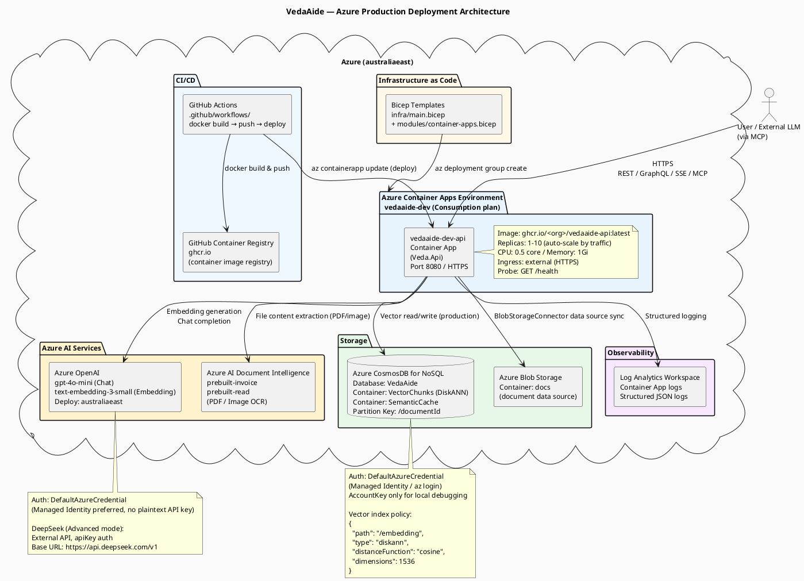
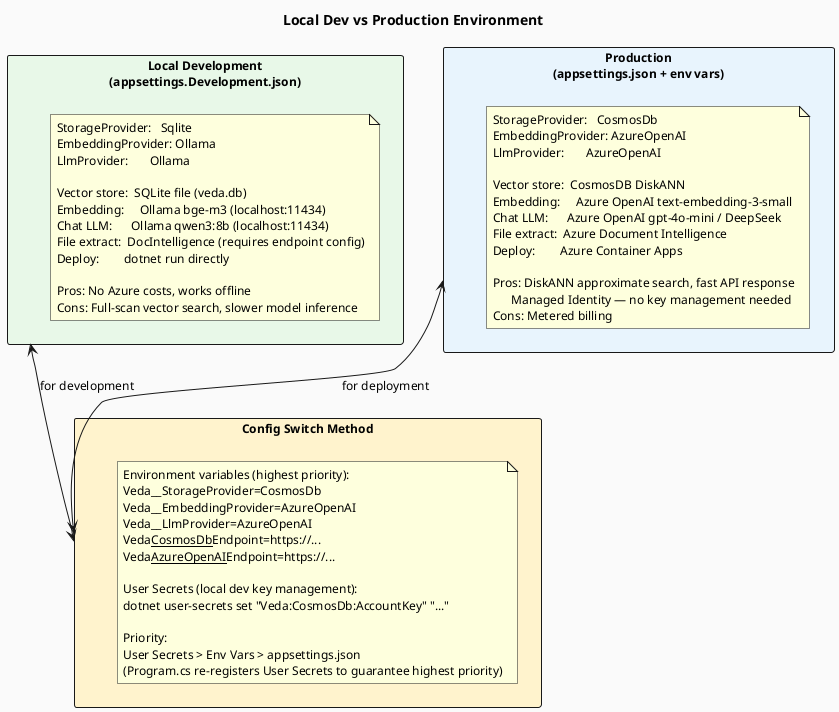
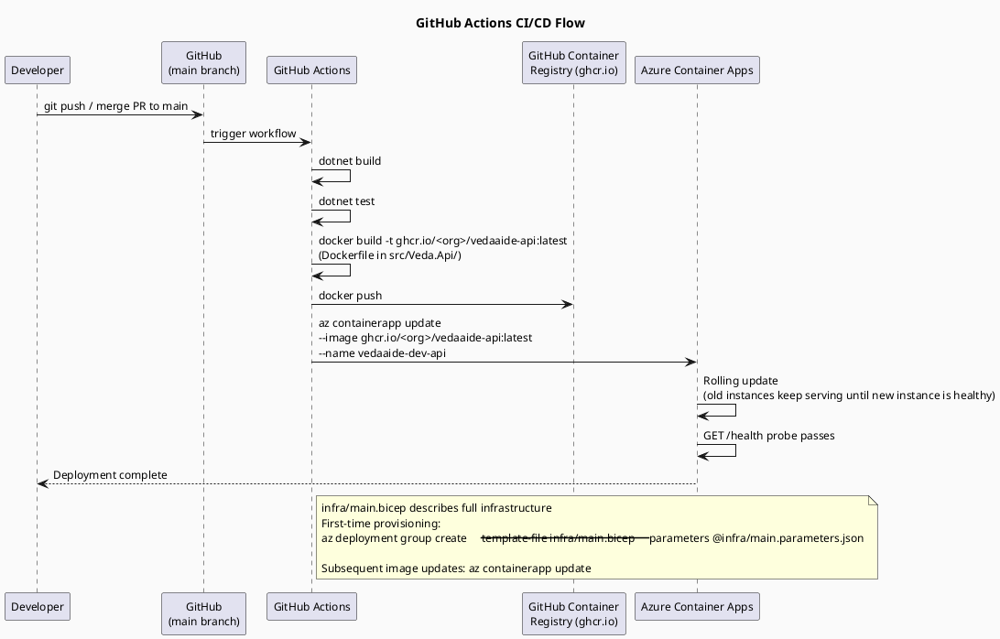

> **Viewing diagrams:** In browser, install [Markdown Diagrams](https://chromewebstore.google.com/detail/markdown-diagrams/mnfehgbmkaijmakeobbflcbldbbldmjh) extension; in VS Code, install [Markdown PlantUML Preview](https://marketplace.visualstudio.com/items?itemName=well-30.plantuml-markdown) plugin.

> 中文版：[08-azure-deployment.cn.md](08-azure-deployment.cn.md)

# 08 — Azure Deployment Architecture

> VedaAide's infrastructure layout on Azure, and how local development maps to cloud resources.

---

## 1. Azure Production Architecture

---

## 2. Local Dev vs Production Environment

---

## 3. CI/CD Deployment Flow

---

## 4. Security Design

| Security Measure | Implementation |
|-----------------|---------------|
| **API Authentication** | `X-Api-Key` request header, validated by `ApiKeyMiddleware`; admin endpoints use `AdminApiKey` |
| **Azure Service Auth** | `DefaultAzureCredential` (Managed Identity / az login); no plaintext API keys in production |
| **HTTPS** | Azure Container Apps enables TLS by default, HTTP → HTTPS redirect |
| **CORS** | `Veda:Security:AllowedOrigins` configures whitelist; default `*` only for development |
| **Rate Limiting** | Fixed window 60 requests/minute (`RateLimiterMiddleware`), prevents abuse |
| **File Upload Limits** | `RequestSizeLimit(20MB)`, only JPEG/PNG/WebP/TIFF/BMP/PDF allowed |
| **Secrets Management** | User Secrets (dev) / Environment vars (prod) / Azure Key Vault (recommended) |
| **Log Safety** | API keys never logged in plaintext; vector data does not contain PII |
| **Privacy by Design** | `UserBehaviors` table only stores chunkId + userId, not raw content |

---

## 5. Health Check Endpoints

| Endpoint | Description | Dependency |
|----------|-------------|------------|
| `GET /health` | Overall health status | All registered health checks |
| `GET /health/ready` | Readiness probe (traffic switchover) | — |
| `CosmosDbHealthCheck` | Validates CosmosDB connectivity | Registered when `StorageProvider=CosmosDb` |
| `AzureOpenAIConfigHealthCheck` | Validates Azure OpenAI configuration | Registered when `EmbeddingProvider=AzureOpenAI` |
