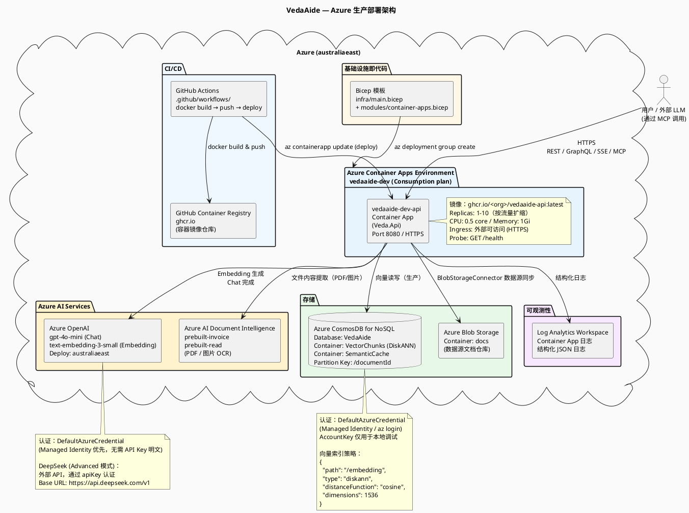
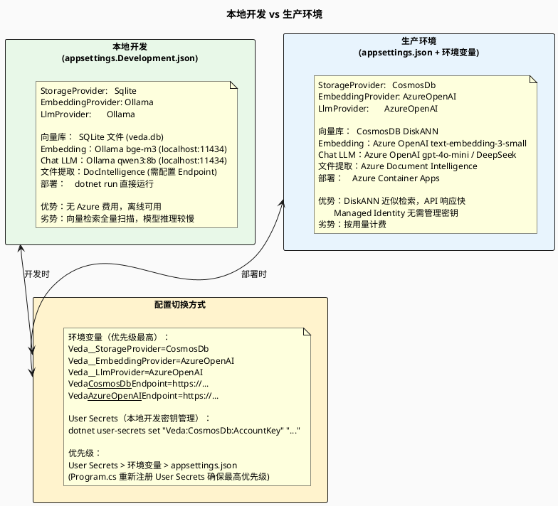
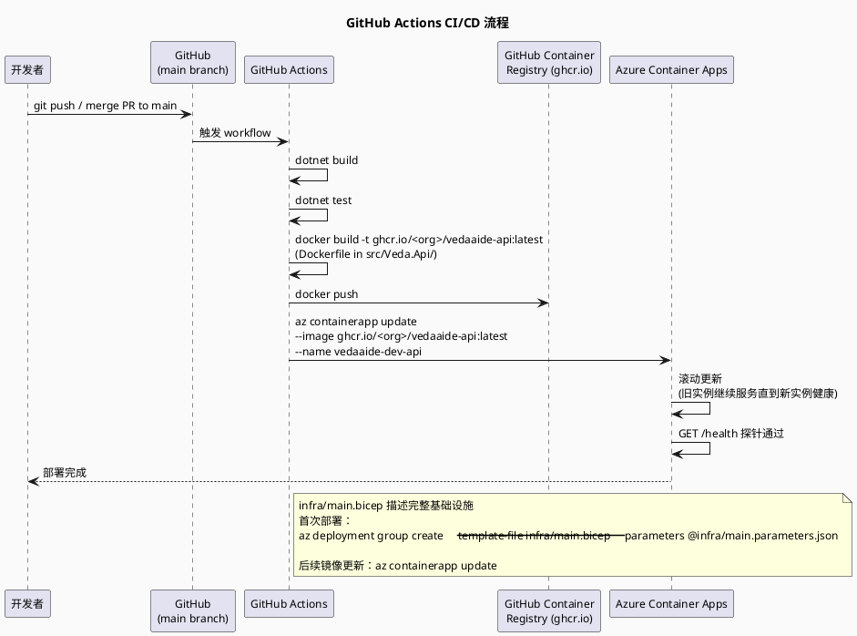

# 08 — Azure 部署架构

> VedaAide 在 Azure 上的基础设施布局，以及本地开发环境与云端的对应关系。

---

## 1. Azure 生产架构图

---

## 2. 本地开发 vs 生产环境对照

---

## 3. 部署 CI/CD 流程

---

## 4. 安全设计

| 安全措施 | 实现方式 |
|---------|---------|
| **API 认证** | `X-Api-Key` 请求头，通过 `ApiKeyMiddleware` 验证；管理接口用 `AdminApiKey` | 
| **Azure 服务认证** | `DefaultAzureCredential`（Managed Identity / az login），生产环境无需明文 API Key |
| **HTTPS** | Azure Container Apps 默认开启 TLS，HTTP → HTTPS 重定向 |
| **CORS** | `Veda:Security:AllowedOrigins` 配置白名单，默认 `*` 仅用于开发 |
| **速率限制** | 固定窗口 60 请求/分钟（`RateLimiterMiddleware`），防止滥用 |
| **文件上传限制** | `RequestSizeLimit(20MB)`，仅允许 JPEG/PNG/WebP/TIFF/BMP/PDF |
| **Secrets 管理** | User Secrets (开发) / 环境变量 (生产) / Azure Key Vault (推荐) |
| **日志安全** | 不记录 API Key 明文；向量数据不包含 PII |
| **隐私设计** | `UserBehaviors` 表只存 chunkId + userId，不记录原始内容 |

---

## 5. 健康检查端点

| 端点 | 说明 | 依赖 |
|------|------|------|
| `GET /health` | 整体健康状态 | 所有注册的 Health Check |
| `GET /health/ready` | 就绪探针（流量切入） | - |
| `CosmosDbHealthCheck` | 验证 CosmosDB 连接 | `StorageProvider=CosmosDb` 时注册 |
| `AzureOpenAIConfigHealthCheck` | 验证 Azure OpenAI 配置 | `EmbeddingProvider=AzureOpenAI` 时注册 |
